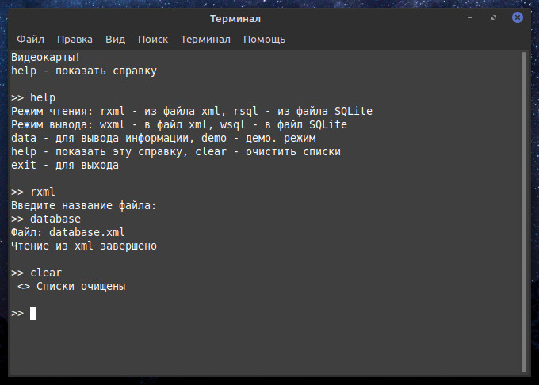

# Задание по ООП (консольный интерфейс)
Данный проект представляет из себя программу с консольным интерфейсом написанную на С++ с использованием QT, SQLite3 и TinyXML.  
***
Схема бд описана в файле "tablesScheme.txt". Примеры xml и db файлов на чтение находятся в директории "datafiles".
***
Ниже представлен пример работы:  
  